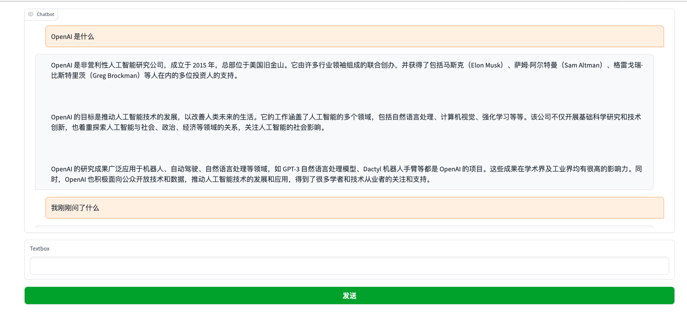

# GChatGPT

Only a small amount of code is needed to implement ChatGPT API visualization.



## Installation

```bash
git clone https://github.com/flyyuan/gchatgpt.git
pip install -r requirements.txt
```

## Usage

modify the `main.py` file to set your own openai api key.
```python
openai.api_key = "your api key"
```

Let's go:
```bash
python main.py
```

